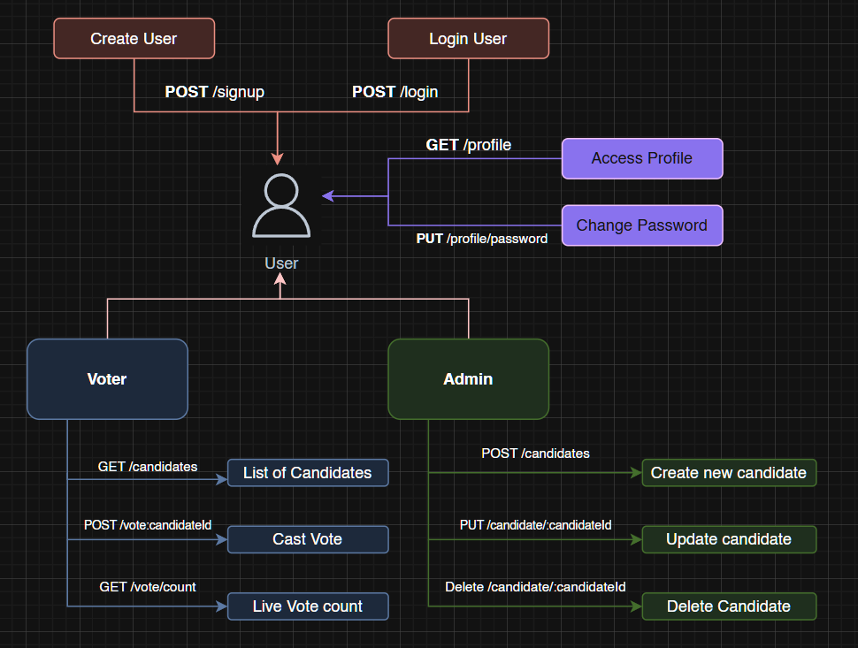

# 🗳️ Voting App MERN

This is a simple full-stack Voting Application built using the **MERN stack**. It includes user authentication, admin-controlled candidate management and creation, and secure voting functionality for registered users.

---

## 🛠️ Tech Stack

- **Frontend**: Next.js
- **Backend**: Node.js, Express.js
- **Database**: MongoDB
- **Authentication**: JWT (JSON Web Tokens)

---

## 🚀 Features

### 👤 Voter

- Sign up & Log in
- Update password
- View profile
- Vote for a favorite candidate _(can vote only once)_

### 🛡️ Admin

- Log in using a secure `JWT_SECRET`
- Add, edit, and delete candidates
- Cannot vote

---

## 🧩 API Endpoints

### 🧑 User Routes

| Method | Endpoint          | Description                    |
| ------ | ----------------- | ------------------------------ |
| POST   | /signup           | Register a new user            |
| POST   | /login            | User login and token retrieval |
| GET    | /profile          | Get current user profile       |
| PUT    | /profile/password | Update user password           |

### 🗳️ Voter Routes

| Method | Endpoint           | Description                |
| ------ | ------------------ | -------------------------- |
| GET    | /candidates        | Get list of all candidates |
| POST   | /vote/:candidateId | Vote for a candidate       |
| GET    | /vote/count        | Get current vote counts    |

### 👨‍💼 Admin Routes

| Method | Endpoint                | Description              |
| ------ | ----------------------- | ------------------------ |
| POST   | /candidates             | Add a new candidate      |
| PUT    | /candidate/:candidateId | Update candidate details |
| DELETE | /candidate/:candidateId | Delete a candidate       |

## 🧩 App Flowchart



## 🧩 Project Structure

The app has two main folders:
/frontend → Next.js frontend
/Backend → Node.js + Express backend

---

## 🔧 Installation & Running Locally

Make sure you have **Node.js** and **MongoDB** installed.

1. Clone the repository:

```bash
git clone https://github.com/yourusername/voting-app-mern.git
cd voting-app-mern
```

2. Open two terminals, one for each folder.

### Frontend (Next.js)

```bash
cd frontend
npm install
npm run dev
```

### Frontend (Node+Express)

```bash
cd Backend
npm install
npm run dev
```

⚠️ Don’t forget to create a .env file in the server directory and add :

```bash
PORT
MONGODB_LOCAL
JWT_SECRET
# Mongo Db Credentials
USERNAME
PASSWORD
MONGODB_URL
```

App is deployed on Vercel

# ⚠️ Notes

- Each user can vote only once.
- Only Admin can Add, Update and Delete candidates.
- Admin cannot vote.

# 📄 License

This project is open-source and available under the MIT License.
