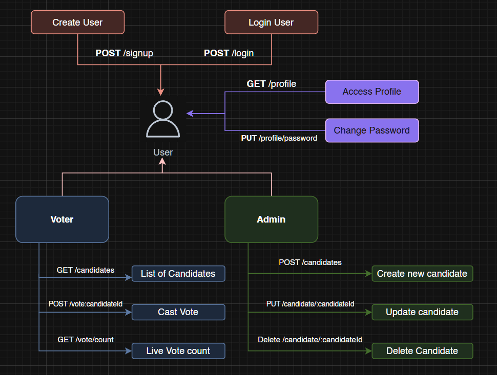

# 🗳️ Voting App (MERN Stack)

This is a simple full-stack Voting Application built using the MERN stack (Except ReactJS maybe it will be updated soon). It includes user authentication, admin-controlled candidate management and creation, and secure voting functionality.

## 📦 Tech Stack

- Node.js
- Express.js
- MongoDB
- Mongoose
- JSON Web Tokens (JWT)
- Bcrypt.js (for password hashing)
- Body Parser
- dotenv

## 🚀 Features

- User Registration & Login
- Profile Viewing and Password Change
- View Candidate List
- Vote for a Candidate (One vote per user)
- View Vote Count (Results)
- Admin: Add, Update, and Delete Candidates

## 🧩 API Endpoints

### 🧑 User Routes

| Method | Endpoint          | Description                    |
| ------ | ----------------- | ------------------------------ |
| POST   | /signup           | Register a new user            |
| POST   | /login            | User login and token retrieval |
| GET    | /profile          | Get current user profile       |
| PUT    | /profile/password | Update user password           |

### 🗳️ Voter Routes

| Method | Endpoint           | Description                |
| ------ | ------------------ | -------------------------- |
| GET    | /candidates        | Get list of all candidates |
| POST   | /vote/:candidateId | Vote for a candidate       |
| GET    | /vote/count        | Get current vote counts    |

### 👨‍💼 Admin Routes

| Method | Endpoint                | Description              |
| ------ | ----------------------- | ------------------------ |
| POST   | /candidates             | Add a new candidate      |
| PUT    | /candidate/:candidateId | Update candidate details |
| DELETE | /candidate/:candidateId | Delete a candidate       |

## 🧩 App Flowchart



## 🛠️ Installation

1. Clone the repository:

   ```bash
   git clone https://github.com/pikacoder44/Voting-App-MERN-stack.git
   cd Voting-App-MERN-stack

   ```

2. Install dependencies:

   npm install

3. Setup environment variables in a .env file:

   MONGODB_LOCAL=your_mongodb_connection_string
   JWT_SECRET=your_secret_key
   PORT=3000

4. Run the server:

   nodemon ./server.js

# 🧪 Testing the API

Use tools like Postman or Insomnia to test endpoints. Make sure to include JWT tokens in Authorization headers for protected routes.

# ⚠️ Notes

- Each user can vote only once.
- Only Admin can Add, Update and Delete candidates.
- Admin cannot vote.

# 📄 License

This project is open-source and available under the MIT License.
